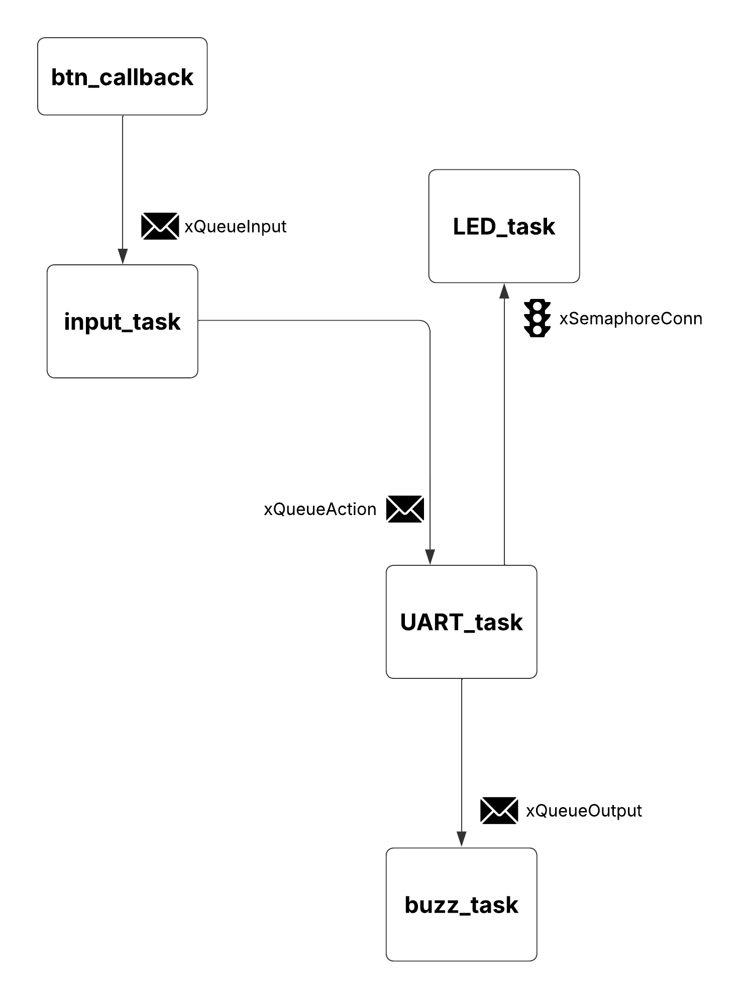
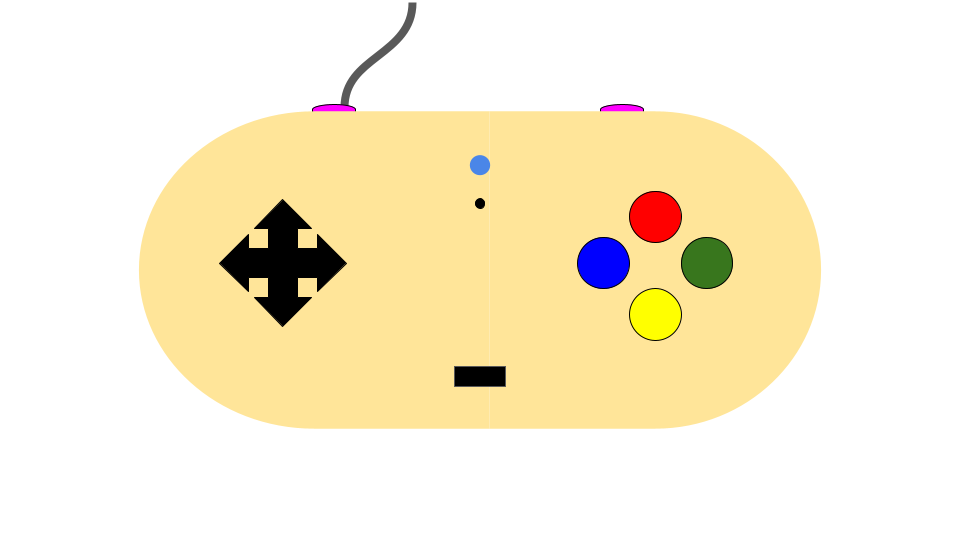

# Controle Customizado para Stardew Valley

## Jogo
**Stardew Valley** - Um jogo de simulação agrícola onde o jogador gerencia uma fazenda, cultivando plantas, criando animais e interagindo com a comunidade local.

## Ideia do Controle
O controle será desenvolvido para facilitar a jogabilidade de *Stardew Valley*, trazendo botões dedicados para ações frequentes como regar plantas, interagir com NPCs e utilizar ferramentas. O design será ergonômico e contará com um sistema simples de botões e feedback por LED.

## Inputs e Outputs
### **Entradas (Inputs)**
- **Joystick analógico:** Para movimentação do personagem.
- **5x Entradas Digitais:**
  - Botão de ação principal (interação com NPCs, uso de ferramentas)
  - Botão de missões
  - Botão de inventário
  - Botão de menu
  - Botão de macro (para ações configuráveis)

### **Saídas (Outputs)**
- **LED indicador de conexão**
- **Buzzer para feedback (vibração e som)**

## Protocolo Utilizado
- **UART (Universal Asynchronous Receiver-Transmitter)** para comunicação entre o controle e o computador.
- **GPIO Interrupts** para os botões e entradas digitais.

## Diagrama de Blocos Explicativo do Firmware
### **Estrutura Geral**
---

---

#### **Principais Componentes do RTOS**
- **Tasks:**
  - Task de leitura de entradas (joystick e botões)
  - Task de envio de comandos via UART
  - Task de controle do buzzer para feedback sonoro
  - Task de atualização do LED indicador

- **Filas:**
  - Fila de eventos de entrada
  - Fila de comandos para o jogo
  - Fila de feedback sonoro para o buzzer

- **Semáforos:**
  - Verificação do estado de conexão

- **Interrupts:**
  - Callbacks para os botões e potenciômetro

## Imagens do Controle
### **Proposta Inicial**
---

---

---
## Link do vídeo
